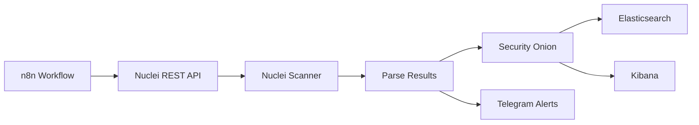
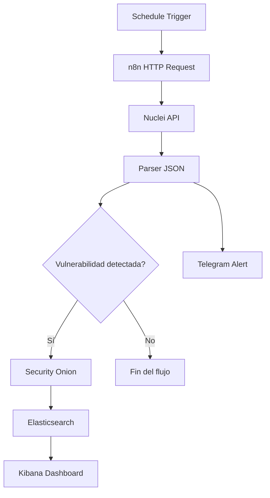

# 🚀 Nuclei REST API


---

## ⚡ Automatización de análisis de vulnerabilidades con Nuclei

API REST basada en Flask que convierte Nuclei en un servicio HTTP automatizado para la ejecución de escaneos de vulnerabilidades.

Diseñada para entornos de:

- 🛡 SOC / Blue Team  
- 🔐 DevSecOps  
- ⚙️ Automatización de seguridad  
- 📊 Monitorización continua de vulnerabilidades  

---

## 📖 Overview

Este proyecto encapsula Nuclei dentro de un contenedor Docker y expone su funcionalidad mediante una API REST.

Permite:

- Ejecutar escaneos remotos bajo demanda  
- Filtrar por CVE o templates específicos  
- Integrarse con pipelines de automatización  
- Centralizar resultados de seguridad  

---

## 🏗 Arquitectura



---

## ⚡ Características

| Feature | Descripción |
|--------|-------------|
| 🔍 Escaneo remoto | Ejecuta Nuclei vía HTTP |
| 🎯 Filtro CVE | Soporte para templates específicos |
| 🐳 Dockerizado | Despliegue rápido |
| 🔄 Automatización | Integración con n8n |
| 📊 SIEM Ready | Security Onion compatible |
| 📱 Alertas | Notificaciones por Telegram |
| ⚡ Ligero | Microservicio minimalista |

---

## 🐳 Instalación

### 🔧 Build de la imagen

```bash
docker build --network=host -t nuclei-api .
```

### 🚀 Ejecutar contenedor

```bash
docker run -d \
  --name nuclei-api \
  -p 5001:5000 \
  nuclei-api
```

### 📌 Verificar

```bash
docker ps
```

---

## 🔌 API Usage

### 📍 Endpoint

```
POST /scan
```

---

### 📦 Request

```json
{
  "target": "http://192.168.1.100",
  "cve": "cve-2011-2523"
}
```

---

### 🧪 Ejemplo con curl

```bash
curl -X POST http://localhost:5001/scan \
-H "Content-Type: application/json" \
-d '{
  "target":"http://192.168.1.100",
  "cve":"cve-2011-2523"
}'
```

---

### 📤 Response

```json
{
  "status": "completed",
  "command": "nuclei -u http://192.168.1.100 -id cve-2011-2523",
  "output": "..."
}
```

---

## 🔄 Workflow de automatización



---

## 🛡 Integración con SOC

Resultados enviados a:

- Elasticsearch  
- Kibana  
- Security Onion  

### Campos recomendados:

- Timestamp  
- CVE  
- Severidad  
- Target  
- Servicio detectado  
- Regla Nuclei  

---

## 📱 Alertas en Telegram

```
🚨 NEW SECURITY ALERT

CVE: CVE-2011-2523
Severity: HIGH
Target: 192.168.1.100

More info:
https://www.incibe.es
```

---

## 🔒 Seguridad

⚠️ Esta API ejecuta escaneos de red.

Recomendado para producción:

- Autenticación JWT o API Key  
- Restricción por IP  
- Rate limiting  
- Logging centralizado  
- Ejecución con mínimos privilegios  
- HTTPS con reverse proxy  

---

## 🚀 Casos de uso

- SOC automation  
- Vulnerability management  
- Pentesting interno  
- DevSecOps pipelines  
- Security monitoring continuo  

---

## 🧰 Tech Stack

- Python 3.10  
- Flask  
- Docker  
- Nuclei  
- n8n  
- Elasticsearch  
- Kibana  
- Security Onion  
- Telegram Bot API  

---

## 📈 Futuras mejoras

- JWT Authentication  
- Gestión de usuarios  
- Base de datos de resultados  
- Dashboard web  
- Detección de duplicados  
- Scans programados  
- Correlación de CVEs  

---

## ⭐ Contribución

Pull requests y mejoras son bienvenidas.

---

## 📄 Licencia

Proyecto educativo para automatización de análisis de vulnerabilidades.
```